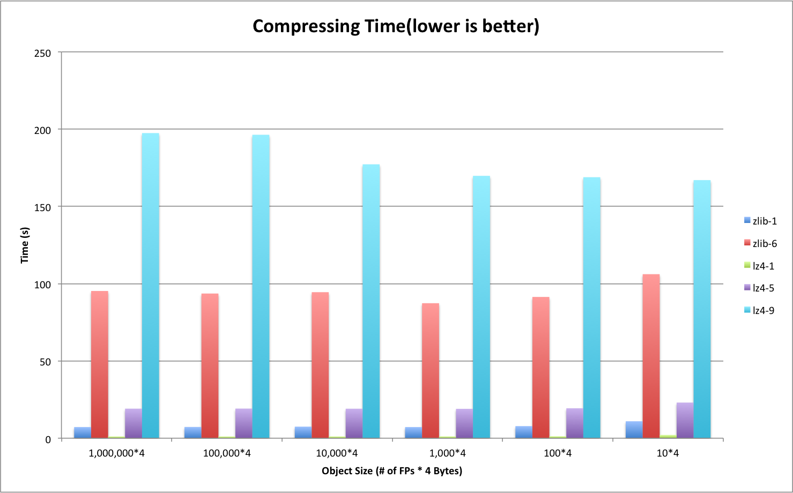
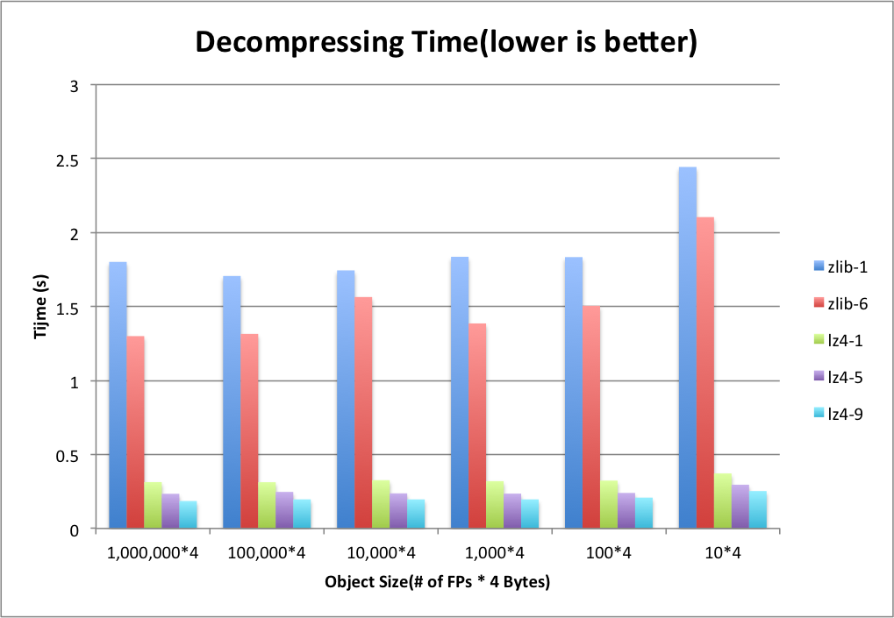
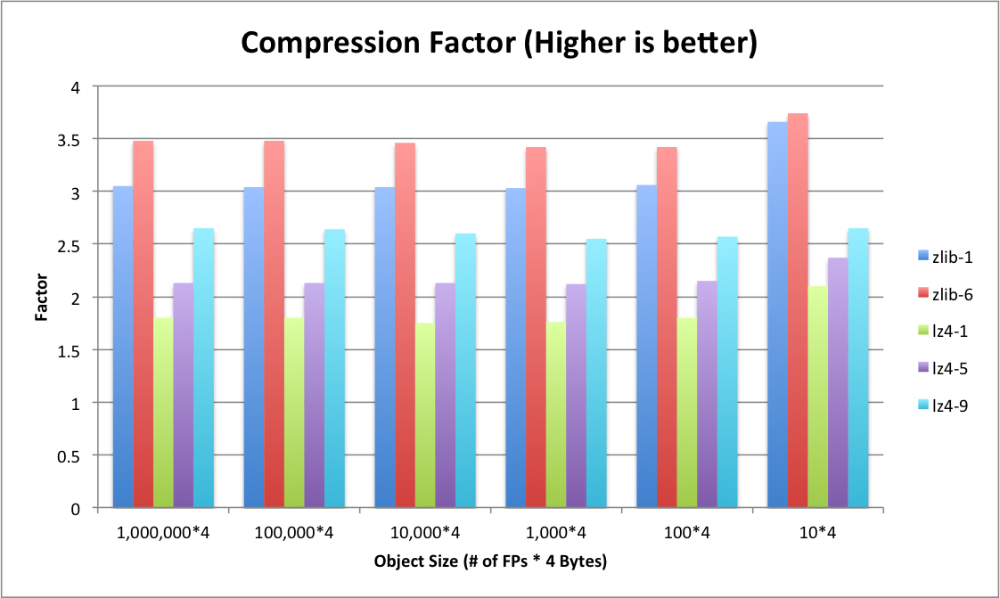
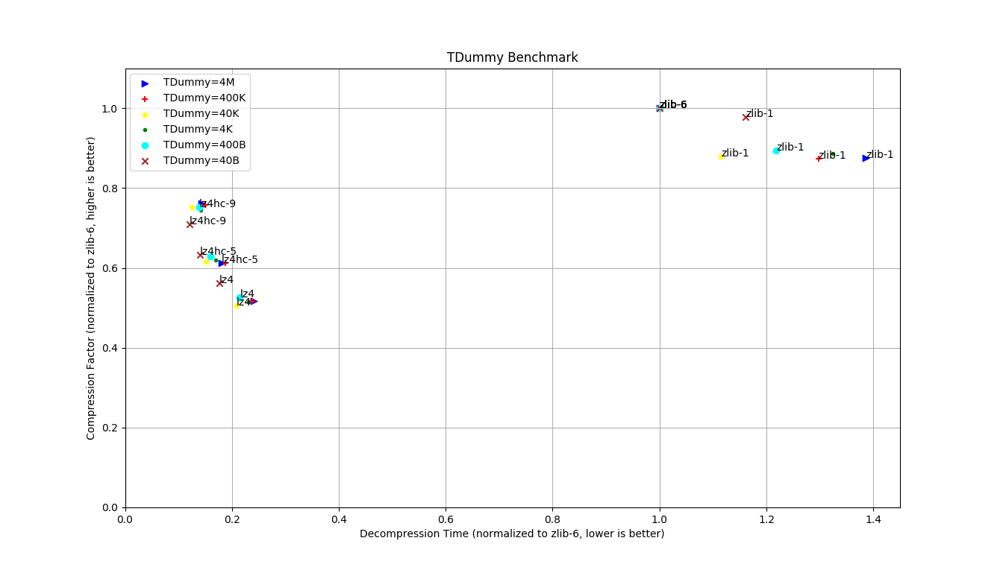

# Project Title

LZ4 vs. ZLIB in ROOT

## Test Setup

We create a class called TDummy in which there are two attribute: fSize and fDummy. fDummy is a array containing fSize number of floating points(FPs). We fill in every byte of the array with ASCII characters ‘a’, ‘b’, ‘c’, ‘d’ following a particular distribution pattern (‘a’: 65%, ‘b’: 25%, ‘c’: 5%, ‘d’: 5%). fSize is a 4-byte integer that define the size of the array.
We generate various object ranging 40 Bytes to 4 MB by tuning fSize of the array. Let’s take 40 B as an example, we set fSize as 10, and fDummy contains 10 FPs, each of which is 4 bytes. Therefore, each object of TDummy is around 40 B (fSize also contributes 4 bytes to the object but this is negligible as fDummy becomes large). Similarly, 4 MB of object has fSize configured as 1,000,000.
In order to conduct a fair experiment, we try to generate the same amount of FPs while we use different object size to fill in baskets. For example, with 40 B of object, we generate 10,000,000 objects. In other words, 400 MB of FPs are generated and stored in a ROOT file. For the case that each object is 4 MB, we only generate 100 objects and the total size of FPs should be the same as before. However, due to the design of ROOT, there is some extra meta-information also needs to be stored in a file. To some degree, meta-information depends objects. Therefore, smaller objects should generate more meta-information. As a result, actual file sizes storing different objects could turn out to be very different even though they contain the same amount of dummy FP data.

## Basket Distribution in the Generated File

In order to characterize meta-information in the ROOT file, we separate fDummy array from other branches. Figure 1 shows the distribution of number of baskets in different branches. Figure 2 shows the distribution of branch sizes. To give a intuitive view of basket sizes, we divide total sizes by the number of baskets and shows the average of basket size in Figure 3. As seen in the figures, the basket size reaches the minimum 58 KB at object size of 4 KB.  The meta-information dramatically increases when object size goes below 4 KB.

  
   <b>Figure 1. Basket Distribution in the Generated File</b> 

  
   <b>Figure 2. Branch Sizes in the Generated File</b> 

  
   <b>Figure 3. Average Basket Sizes in the Generated File</b> 

## Compressing Time 

Figure 4 illustrates the compressing time of different algorithms. ZLIB and LZ4 interleave with each other at different compression levels. LZ4-9 is the slowest and then in decreasing order followed by ZLIB-6, LZ4-5, ZLIB-1 and LZ-1.

  
   <b>Figure 4. Compressing Time on the Generated File</b> 

## Decompressing Time

Figure 5 shows the decompressing time of ZLIB and LZ4 on the generated file. Unlike compressing time, LZ4’s decompression speed outperforms ZLIB at all levels. Based on our measurement, the decompression speed of LZ4 is generally 4~7 times faster than ZLIB. As the object size goes to 40 B, there is a sudden jump on the decompressing time. We analyze the case in the next section.

  
   <b>Figure 5. Decompressing Time on the Generated File</b> 

## Sensitivity of Event Size on Decompressing Time

To demonstrate what happens on tiny object cases, we zoom in the Figure 5 and take a closer look at two compressors. Figure 6 and Figure 7 shows the decompressing time of ZLIB and LZ4 respectively. In addition, we plot the total CPU cycles consumed during decompressing the file. As seen in Figure 6, ZLIB’s decompression occupies relatively 2/3 of the total CPU cycles. Other 1/3 of CPU cycles are contributed but not limited by deserialization. Unlike ZLIB, LZ4 shown in Figure 7 relax the CPU a little bit and contributes to 1/4 of total cycles.
When we deal with tiny objects (40 B in the figures), both ZLIB and LZ4 have a slight increase on decompression part like bold lines shown in two figures. However, comparing to deserialization, this change does not have significant impact. Deserialization starts stressing out CPU quickly in this case.

  
   <b>Figure 6. Decompressing Time of ZLIB</b> 

  
   <b>Figure 7. Decompressing Time of LZ4</b> 

## Compression Ratio

Faster decompression speed comes with a downside that LZ4 gains less compression ratios than ZLIB. Figure 6 shows compression factors (compression ratios). For each algorithm, higher level produce higher compression ratio. LZ4 is not as storage efficient as ZLIB. LZ4 gets less compression ratios at all levels comparing to ZLIB.

  
   <b>Figure 8. Compressing Ratios on the Generated File</b> 

## Conclusions

In general, LZ4 is paying for decompression speed at the expense of storage space. Figure 9 shows the tradeoffs of different compression schemes. LZ4 allows decompression speed at 4~7 times faster than ZLIB while sufferring more storage cost.

  
   <b>Figure 9. Tradeoff between Decompressing Time and Compression Ratio</b> 

Additionally, the compressing time are mixed by different levels of two compressors. The general rule is LZ4-9 > ZLIB-6 > LZ4-5 > ZLIB-1 > LZ4-1.

